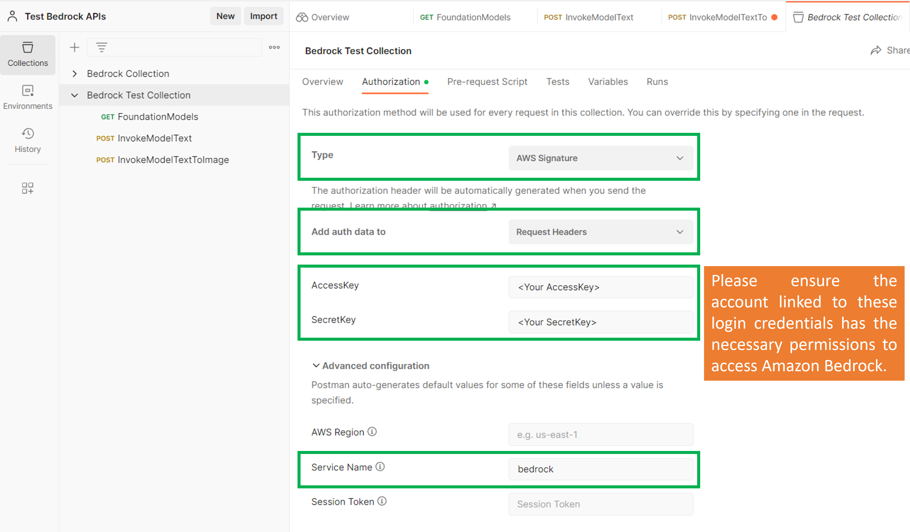

# 🤖 💪 🚀 Amazon Bedrock API Demo with Postman 🤖 💪 🚀 

Welcome to this demo where interact with the Amazon Bedrock API using Postman.

This demo shows you three key interactions with the API: 

1. Listing Foundation Models
2. Text Generation
3. Text to Image

## Prerequisites

Before we dive in, make sure you have the following:

- Postman installed on your machine. Postman is a popular tool for testing APIs in an easy-to-use graphical environment.
- Your Amazon Bedrock API credentials. Remember to store these in a safe place and follow a least privilege approach to prevent any security issues.

## Getting Started

### Setting Up Postman

1. Open Postman.
2. Import the collection included in this repository.
3. You need to configure the collection as is shown in the following image:

### List Foundation Models

This request is the equivalent of the "Hello World" for Amazon Bedrock. It lists all the supported Foundation Models for your account.

### Text Generation

This request involves generating text using one of the models. For this demo, we used the Anthropic's Claude Instant V1 model.

### Text to Image

This request involves generating an image from text. We used the Stability AI model for this.

## Call to Action

Now that you have seen how to interact with the Amazon Bedrock API using Postman, it's your turn to try it out. Experiment with different models and parameters to see the different results you can achieve.

## Important Note

⚠️ Remember to keep your API credentials secure and follow the least privilege principle when setting up your IAM policies. This is crucial for maintaining the security of your resources. ⚠️

Please be aware of the following points:

- Postman is a product developed by a third-party company, not Amazon Web Services (AWS).
- AWS does not provide support for Postman.
- For more information on how to use Postman, or if you need help with any Postman-related issues, please visit the Support center on the Postman website.

These points are crucial to remember as you navigate through the process of using Postman with AWS. It's always important to refer to the correct resources for support and assistance.

### 🥼🔬 Happy experimenting! 🔬🥼
